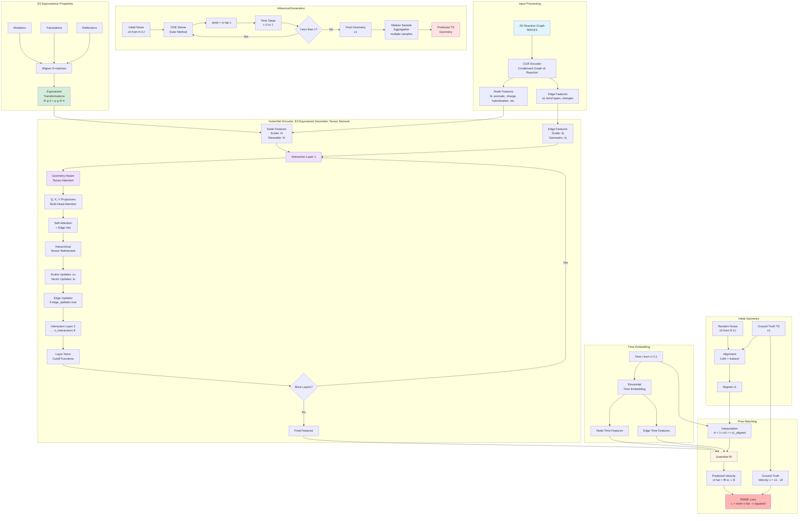

# GoFlow Architecture

```mermaid
graph TB
    subgraph "Input Processing"
        A[2D Reaction Graph<br/>SMILES] --> B[CGR Encoder<br/>Condensed Graph of Reaction]
        B --> C[Node Features<br/>hi: aromatic, charge, hybridization, etc.]
        B --> D[Edge Features<br/>ej: bond types, changes]
    end
    
    subgraph "Initial Geometry"
        E[Random Noise<br/>x0 from N 0,I] --> F[Alignment<br/>CoM + Kabsch]
        G[Ground Truth TS<br/>x1] --> F
        F --> H[Aligned x1]
    end
    
    subgraph "Time Embedding"
        I[Time t from U 0,1] --> J[Sinusoidal<br/>Time Embedding]
        J --> K[Node Time Features]
        J --> L[Edge Time Features]
    end
    
    subgraph "GotenNet Encoder: E3-Equivariant Geometric Tensor Network"
        M[Node Features<br/>Scalar: hi<br/>Steerable: Xi] --> N[Interaction Layer 1]
        O[Edge Features<br/>Scalar: tij<br/>Geometric: rij] --> N
        
        N --> P[Geometry-Aware<br/>Tensor Attention]
        P --> Q[Q, K, V Projections<br/>Multi-Head Attention]
        Q --> R[Self-Attention<br/>+ Edge Info]
        
        R --> S[Hierarchical<br/>Tensor Refinement]
        S --> T[Scalar Updates: su<br/>Vector Updates: tu]
        
        T --> U[Edge Updates<br/>if edge_updates true]
        
        U --> V[Interaction Layer 2<br/>... n_interactions 8]
        V --> W[Layer Norm<br/>Cutoff Functions]
        
        W --> X{More Layers?}
        X -->|Yes| N
        X -->|No| Y[Final Features]
    end
    
    subgraph "Flow Matching"
        H --> Z[Interpolation<br/>xt = 1-t x0 + t x1_aligned]
        K --> AA[GotenNet fθ]
        L --> AA
        Y --> AA
        Z --> AA
        
        AA --> AB[Predicted Velocity<br/>vt hat = fθ xt, t, B]
        
        G --> AC[Ground Truth<br/>Velocity v = x1 - x0]
        AB --> AD[RMSE Loss<br/>L = norm v hat - v squared]
        AC --> AD
    end
    
    subgraph "Inference/Generation"
        AE[Initial Noise<br/>x0 from N 0,I] --> AF[ODE Solver<br/>Euler Method]
        AF --> AG[dx/dt = vt hat x]
        AG --> AH[Time Steps<br/>t: 0 to 1]
        AH --> AI{t less than 1?}
        AI -->|Yes| AF
        AI -->|No| AJ[Final Geometry<br/>x1]
        
        AJ --> AK[Median Sample<br/>Aggregation<br/>multiple samples]
        AK --> AL[Predicted TS<br/>Geometry]
    end
    
    subgraph "E3 Equivariance Properties"
        AM[Rotations] --> AN[Wigner D-matrices]
        AO[Translations] --> AN
        AP[Reflections] --> AN
        AN --> AQ[Equivariant<br/>Transformations<br/>Φ g X = ρ g Φ X]
        AQ --> M
    end
    
    C --> M
    D --> O
    I --> Z
    
    style A fill:#e1f5ff
    style AL fill:#ffe1e1
    style AA fill:#fff4e1
    style N fill:#f0e1ff
    style P fill:#f0e1ff
    style AD fill:#ffb3b3
    style AQ fill:#d4edda
```